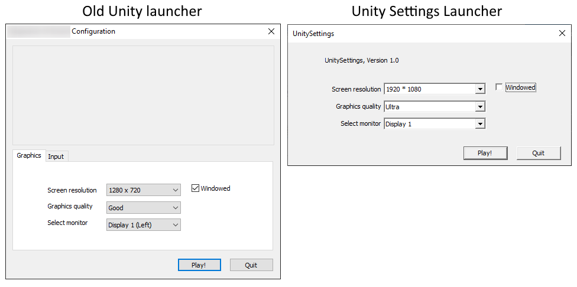

# UnitySettings
Simple launcher for Unity games that let you select graphic settings (only windows version for now)

## How to use
You can just copy-paste the UnitySettings.exe into your game folder (beside your game exe) and launch UnitySettings.exe
If you want to change what exe is launched (auto-detection fails) or to change quality list, see 'setting' section below

## What's this?
The goal of this project is to get back the old Unity laucher that disapeared around version 2020 at least for graphic settings
With this, you can select your resolution, monitor, windowed mode and quality of any Unity game without having to integrate in-game UI
It's ideal for jam game and quick prototypes


## Settings
When you launch UnitySettings for the first time, it will create a UnitySettings.json file in the same folder
You can modify the json file and distribute it with the exe if you want to change it
``` javascript
{
	"ExeName": "*.exe",
	"QualityModes": [
		"Low",
		"Medium",
		"High",
		"Very High",
		"Ultra" 
	] 
} 
```
Registry keys are used to keep trace of the last selection on user's computer

## Issues
This exe uses Command Line arguments to set Unity's settings
Unfortunately, Unity doesn't reconise the lowest quality settings from command line (-screen-quality 0)
So the quality list in json file should only contain qualities above the lowest one